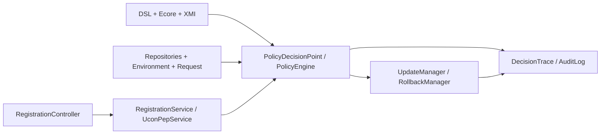

# UCONKMA


He thong nghien cuu va hien thuc mo hinh `UCON` cho bai toan dang ky hoc phan tai KMA.

## 1. Muc tieu de tai

Project nay dung DSL rieng de:

- dac ta policy UCON theo `Authorization / Obligation / Condition`
- sinh `XMI policy model` tu DSL
- nap policy model vao `PDP`
- danh gia request `REGISTER / DROP` o runtime
- cap nhat mutable attributes, rollback, trace, audit

Ban hien tai da duoc nang cap theo huong `UCONKMA v2/v3-ready` voi:

- `predicate`: `AUTHORIZATION`, `OBLIGATION`, `CONDITION`
- `phase`: `PRE`, `ONGOING`, `POST`
- `updateTiming`: `NONE`, `PRE`, `ONGOING`, `POST`
- `policy metadata`: `source`, `version`, `policyStatus`, `uconVariant`

## 2. UCON trong project nay

Anh xa UCON trong repo:

- `Subject`: `Student`
- `Object`: `ClassSection`
- `Right/Action`: `REGISTER`, `DROP`
- `Environment`: registration phase, current date, semester, maintenance flag

Project the hien ro:

- `Authorization`
- `Obligation`
- `Condition`
- `mutability`
- `continuity`
- `traceability`

## 3. Kien truc PEP / PDP / PIP / PAP



Thanh phan chinh:

- `PAP`
  - `dsl/ucon_policy.dsl`
  - `metamodel/ucon.ecore`
  - `xmi/ucon_policy.xmi`
- `PEP`
  - `RegistrationController`
  - `RegistrationService`
  - `UconPepService`
  - `UconExecutionWorkflow`
- `PDP`
  - `PolicyDecisionPoint`
  - `PolicyEngine`
  - `AuthorizationEvaluator`
  - `ConditionEvaluator`
  - `ObligationEvaluator`
- `PIP`
  - `PolicyInformationPoint`
  - `StudentRepository`
  - `ClassSectionRepository`
  - `RegistrationRepository`
  - `AuditLogRepository`
- `Continuous monitoring`
    - `OngoingMonitor`
    - `SessionRecheckService`
    - `ClassStatusChangedEvent`
    - `MaintenanceEnabledEvent`
    - `StudentHoldAddedEvent`
    - `PolicyAdministrationController`

## 4. DSL policy example

```dsl
policy P20_ReserveSeat_OnA2 {
    predicate: AUTHORIZATION
    phase: ONGOING
    updateTiming: ONGOING
    targetAction: REGISTER
    effect: PERMIT
    priority: 25
    description: "Giu tam mot cho truoc khi commit dang ky"
    subjectType: "Student"
    objectType: "ClassSection"
    denyReason: "NO_SEAT_TO_RESERVE"

    condition: (object.enrolled + object.reservedSeats) < object.capacity

    ongoingUpdates:
       object.reservedSeats ADD_ASSIGN 1

    rollbackUpdates:
       object.reservedSeats SUB_ASSIGN 1
}
```

## 5. Metamodel va XMI

Pipeline hien tai:

```text
DSL policy
-> ANTLR parser / AST visitor
-> EMF PolicyModel
-> xmi/ucon_policy.xmi
-> PolicyDecisionPoint load
-> PolicyEngine evaluate
-> DecisionTrace / AuditLog
```

Artifact chinh:

- [dsl/UconPolicy.g4](dsl/UconPolicy.g4)
- [metamodel/ucon.ecore](metamodel/ucon.ecore)
- [xmi/ucon_policy.xmi](xmi/ucon_policy.xmi)
- [dsl/src/main/java/vn/edu/kma/ucon/parser/UconDslToXmiParser.java](dsl/src/main/java/vn/edu/kma/ucon/parser/UconDslToXmiParser.java)

`XMI` hien tai da duoc lam ro hon theo `Ecore`:

- policy ghi explicit `predicate`, `phase`, `updateTiming`, `targetAction`, `effect`
- policy ghi explicit `source`, `version`, `policyStatus`, `uconVariant`
- `VariableAccess` ghi explicit `entity`
- `LogicalOperator` / `RelationalOperator` ghi explicit `operator`

`PolicyDecisionPoint` hien tai load model theo trinh tu:

1. load `PolicyModel` tu `XMI`
2. semantic validate
3. policy analyze
4. `PolicyAdministrationPoint` loc chi giu `ACTIVE` policies cho runtime

Kiem chung phu hop metamodel da co test rieng:

- `test36_XmiPolicyModelConformsToEcoreAndSemanticRules`
- test nay load truc tiep `metamodel/ucon.ecore` va `xmi/ucon_policy.xmi` bang EMF, sau do chay `semanticValidator` va `policyValidator`

## 6. Policy coverage

Nhung bien the UCONABC da bao phu tot:

- `preA0`, `preA1`
- `preB0`
- `preC0`
- `onA0`, `onA2`
- `onB0`
- `onC0`
- `postA3`
- `postB3`

Policy tieu bieu:

- `P01_TuitionPaid_PreA0`
- `P02_TransactionWindow_PreC0`
- `P17_AgreeRegistrationRule_PreB0`
- `P20_ReserveSeat_OnA2`
- `P27_SessionLease_OnB0`
- `P12_AuditAndTrace_PostB3`

Chi tiet:

- [docs/ucon_mapping.md](docs/ucon_mapping.md)
- [docs/ucon_coverage_report.md](docs/ucon_coverage_report.md)
- [docs/policy_catalog.md](docs/policy_catalog.md)

## 7. Verification va analysis

Project da co:

- `attribute-schema.yml`
  - mutable / immutable schema
- `PolicyValidator`
  - semantic + schema validation
- `PolicyAnalyzer`
  - `missing rollback`
  - `missing audit`
  - `priority collision`
  - `shadowing`
  - `conflicting priority`
  - `redundant policy`
  - `unsafe update`
  - `incomplete DROP flow`
- `DomainInvariantChecker`
  - `enrolled <= capacity`
  - `tuitionDebt >= 0`
  - `currentCredits <= maxCreditsEffective`
- explicit build tooling:
  - `maven-surefire-plugin`
  - `maven-enforcer-plugin`
  - `jacoco-maven-plugin`
  - `spotless-maven-plugin` profile `format-check`
- local coverage from `JaCoCo`:
  - line coverage: `80.72%`
  - branch coverage: `60.98%`

## 8. Build / test / run

### Build DSL

```bash
cd dsl
mvn clean install
```

### Test engine

```bash
cd engine
mvn clean test
```

### Test DSL parser

```bash
cd dsl
mvn test
```

### Run theo test / policy id

```powershell
cd engine
.\run-test.ps1 T01
.\run-test.ps1 P20
.\run-test.ps1 REPORT
```

### Run Spring Boot app

```bash
cd engine
mvn spring-boot:run
```

### Optional format check

```bash
cd engine
mvn -Pformat-check spotless:check
```

GitHub Actions cung chay buoc format check nay truoc khi build DSL va test engine.

Neu dung Windows va Maven bundle trong repo, co the thay `mvn` bang
`.\apache-maven-3.9.6\bin\mvn.cmd` sau khi `cd` vao module tuong ung.

## 9. REST API demo

Endpoint chinh:

- `POST /api/register`
- `POST /api/drop`
- `GET /api/demo/state`

Response deny co traceability:

```json
{
  "requestId": "demo-1",
  "action": "REGISTER",
  "decision": "DENY",
  "phase": "PRE",
  "predicate": "AUTHORIZATION",
  "failedPolicy": "P01_TuitionPaid_PreA0",
  "denyReason": "TUITION_NOT_PAID",
  "sessionStatus": "FAILED",
  "explanation": "Sinh vien chua hoan tat hoc phi nen request bi chan truoc khi dang ky xay ra.",
  "decisionTrace": {
    "requestId": "demo-1",
    "action": "REGISTER",
    "decision": "DENY",
    "phases": []
  }
}
```

## 10. Tai lieu quan trong trong docs

Neu can viet bao cao / bao ve:

1. [docs/ucon_mapping.md](docs/ucon_mapping.md)
2. [docs/ucon_coverage_report.md](docs/ucon_coverage_report.md)
3. [docs/policy_catalog.md](docs/policy_catalog.md)
4. [docs/metamodel_mapping.md](docs/metamodel_mapping.md)
5. [docs/validation_rules.md](docs/validation_rules.md)
6. [docs/decision_trace_examples.md](docs/decision_trace_examples.md)
7. [docs/formal_semantics.md](docs/formal_semantics.md)
8. [docs/test-result.md](docs/test-result.md)
9. [docs/final_code_quality_checklist.md](docs/final_code_quality_checklist.md)
10. [docs/final_release_checklist.md](docs/final_release_checklist.md)
11. [docs/raw_github_format_verification.md](docs/raw_github_format_verification.md)
12. [docs/benchmark_result.md](docs/benchmark_result.md)
13. [docs/rbac_abac_ucon_comparison.md](docs/rbac_abac_ucon_comparison.md)
14. [docs/mutation_testing.md](docs/mutation_testing.md)
15. [docs/current_vs_maximum_version.md](docs/current_vs_maximum_version.md)
16. [docs/generated/policies.md](docs/generated/policies.md)
17. [docs/generated/ucon_coverage.md](docs/generated/ucon_coverage.md)
18. [docs/generated/validation_report.md](docs/generated/validation_report.md)

Neu can chay demo:

1. [docs/guides/HUONG_DAN_CHAY_CHI_TIET.md](docs/guides/HUONG_DAN_CHAY_CHI_TIET.md)
2. [docs/guides/HUONG_DAN_REST_API_CHUAN.md](docs/guides/HUONG_DAN_REST_API_CHUAN.md)
3. [docs/guides/KICH_BAN_NOI_DEMO_RUNTIME_3_5P.md](docs/guides/KICH_BAN_NOI_DEMO_RUNTIME_3_5P.md)

## 11. Ket qua hien tai

Baseline da verify:

- `engine`: `Tests run: 55, Failures: 0, Errors: 0, Skipped: 0`
- `dsl`: `BUILD SUCCESS`
- `benchmark suite`: `BUILD SUCCESS`
- `PAP lifecycle`: co the transition policy va runtime chi giu `ACTIVE`

## 12. Known limitations

Repo hien tai da rat gan tinh than UCON, nhung van con gioi han ro rang:

- chua bao phu day du toan bo `24` bien the con cua `UCONABC`
- `ONGOING` hien da co ca `transaction-level re-check` va `event-driven revoke` cho `ACTIVE` sessions, nhung chua la mot monitoring ha tang dai han phuc tap
- chua co scheduler / distributed event bus cho `long-running continuous monitoring` day du
- `PolicyAnalyzer` la heuristic analyzer, chua dung `SMT/solver`
- benchmark hien tai co micro-benchmark policy pipeline va benchmark API nho cho `register/drop`, chua la end-to-end load test nhieu client song song
- PAP/lifecycle hien da co `policyStatus`, `PolicyLifecycleService`, `PolicyAdministrationController` va runtime chi load `ACTIVE` policies, nhung chua co persistence/versioning day du nhu mot PAP san xuat

Nhung gioi han nay da duoc ghi ro trong docs de tranh mo ta qua muc so voi pham vi do an.
