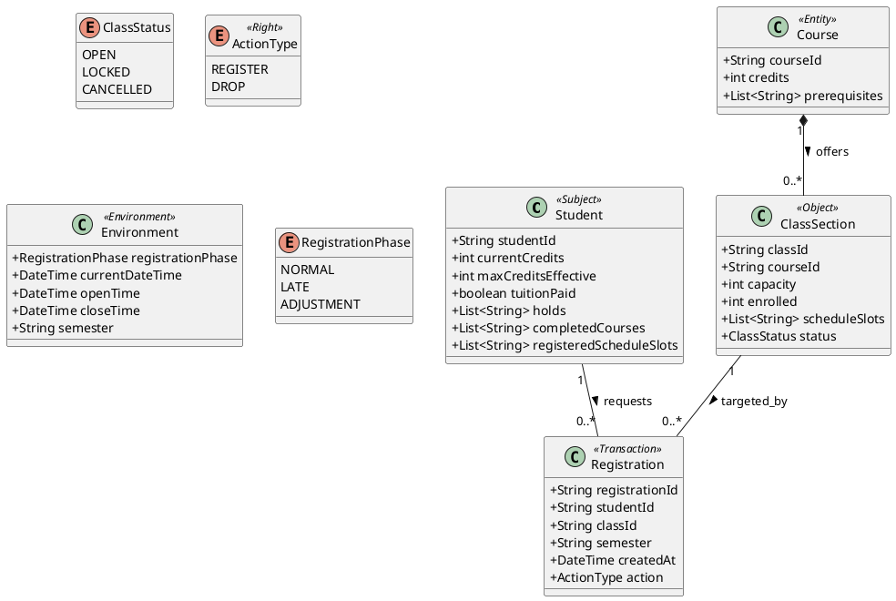

# Chương 3: Thiết kế Mô hình Logic Toán và 12 Chính sách UCON

Chương này trình bày cách trừu tượng hóa các thực thể của KMA thành mô hình khái niệm tĩnh (Domain Model) để làm nền tảng sinh mã XMI Schema, đồng thời phát biểu **12 quy tắc nghiệp vụ** theo ngôn ngữ giả mã (Pseudo-logic) mang các đặc tính chuyên biệt của UCON (`preAuthorization`, `ongoingAuthorization`, `postUpdate`).

## 1. Thiết kế UML Domain Model (Bước 2)

Dưới đây là thiết kế tĩnh của các Subject, Object và quan hệ giữa chúng. Thiết kế này đặc biệt ánh xạ trực tiếp sang các kiểu dữ liệu của EMF Ecore (`EString`, `EInt`, `EBoolean`, `EList`) dùng cho việc khởi tạo Metamodel.

### 1.1 Sơ đồ lớp (Class Diagram)



### 1.2 Định nghĩa Quan hệ (Relationships)

1. **Course `1` *-- `0..*` ClassSection (Composition):**
   - Một Môn học (Course) chứa danh sách các Lớp học phần (ClassSection) được mở trong học kỳ đó.
   - Khi Môn học không còn tồn tại, mọi Lớp học phần thuộc về nó cũng không còn ý nghĩa.
   - Quan hệ này đảm bảo `class.courseId` trỏ trực tiếp đến Môn học gốc để lấy tổng `credits` đem đi validation.

2. **Student `1` -- `0..*` Registration (Association):**
   - Một Sinh viên có thể tạo ra nhiều giao dịch Đăng ký (Register/Drop).
   - Chiều liên kết này giúp traceback xem user nào tạo request.

3. **ClassSection `1` -- `0..*` Registration (Association):**
   - Mỗi Lớp học phần ghi nhận danh sách các giao dịch giáng xuống nó.
   - Cho phép system tính toán dòng lịch sử của biến đổi `enrolled`.

### 1.3 Định nghĩa Kiểu dữ liệu tương thích Ecore (Data Types Mapping)

Vì toàn bộ model này sau đó sẽ được rập khuôn lại bằng EMF Ecore XML Schema (`ucon.ecore`), nên kiểu dữ liệu phải được chuẩn hóa 1-1:

| Kiểu Java/UML | Kiểu EMF Ecore Tương đương | Giải thích cho UCON Engine |
| :--- | :--- | :--- |
| `String` | `EString` | Dùng cho dạng Text/Identifier (VD: `studentId`, `classId`). |
| `int` | `EInt` | Dùng cho Phép toán số học (VD: tính tổng Tín chỉ, capacity, enrolled). |
| `boolean` | `EBoolean` | Dùng cho Logic Pass/Fail trực tiếp (VD: `tuitionPaid`). |
| `List<String>` | `EString` (với `upperBound="-1"`) | Dùng cho Toán tử tập hợp `⊆`, `CONTAINS` (VD: `completedCourses`, `holds`, `scheduleSlots`). |
| `Enum` | `EEnum` | Dùng quy hoạch Trạng thái cố định (VD: `ClassStatus.OPEN`, `RegistrationPhase.NORMAL`). |
| `DateTime` | `EDate` (hoặc `EString` parse logic) | Dùng cho toán tử so sánh Khoảng lồng nhau của TimeWindow. |

---

## 2. Đặc tả 12 Chính sách UCON bằng Giả mã DSL (Bước 3)
Hệ thống điều khiển (UCON) tại KMA quy định rõ 12 bộ Policy chặt chẽ phủ kín toàn bộ vòng đời của một Request Đăng ký (Register/Drop). Thuật toán biểu diễn (Giả mã) dưới đây được thiết kế ánh xạ 1-1 với Abstract Syntax Tree (AST) của `ucon.ecore` để chuẩn bị cho giai đoạn xây dựng Parsers (Bước 4 & 5).

### A. PRE-AUTHORIZATION (7 policies)
Thực thi chốt chặn ngay từ cửa vòng ngoài dựa trên các thuộc tính tĩnh hoặc lịch sử. Các rules được evaluate theo thứ tự priority giảm dần.

**1) P01_TuitionPaid_Pre**
- **Cần thiết vì:** Đây là ràng buộc hành chính cốt lõi nhất. Tránh việc sinh viên nợ học phí tiếp tục đăng ký.
```dsl
policy P01_TuitionPaid_Pre {
    type: PRE_AUTHORIZATION
    targetAction: ANY
    effect: PERMIT
    priority: 100
    description: "Chỉ cho phép SV đã hoàn tất học phí"
    denyReason: "TUITION_NOT_PAID"
    
    condition: subject.tuitionPaid == true
}
```

**2) P02_RegistrationWindow_Pre**
- **Cần thiết vì:** Ràng buộc môi trường (Environment) ép giao dịch phải nằm trong khung thời gian quy định.
```dsl
policy P02_RegistrationWindow_Pre {
    type: PRE_AUTHORIZATION
    targetAction: ANY
    effect: PERMIT
    priority: 90
    description: "Chỉ cho đăng ký trong đợt và giờ hợp lệ"
    denyReason: "OUTSIDE_REGISTRATION_WINDOW"
    
    condition: environment.registrationPhase IN ["NORMAL", "LATE"] 
               AND environment.currentDateTime >= environment.openTime 
               AND environment.currentDateTime <= environment.closeTime
}
```

**3) P03_ClassStatusOpen_Pre**
- **Cần thiết vì:** Tránh lọt request vào các lớp đang bị khóa/hủy tạm thời.
```dsl
policy P03_ClassStatusOpen_Pre {
    type: PRE_AUTHORIZATION
    targetAction: REGISTER
    effect: PERMIT
    priority: 80
    description: "Chỉ lớp đang mở thực sự mới được đăng ký"
    denyReason: "CLASS_NOT_OPEN"
    
    condition: object.status == "OPEN"
}
```

**4) P04_NotAlreadyRegistered_Pre**
- **Cần thiết vì:** Bảo toàn tính nhất quán dữ liệu ở mức Database (Chống duplicate).
```dsl
policy P04_NotAlreadyRegistered_Pre {
    type: PRE_AUTHORIZATION
    targetAction: REGISTER
    effect: PERMIT
    priority: 70
    description: "Không cho đăng ký trùng cùng lớp"
    denyReason: "ALREADY_REGISTERED"
    
    condition: NOT checkExistsRegistration(subject.studentId, object.classId, environment.semester)
}
```

**5) P05_CreditLimit_Pre**
- **Cần thiết vì:** Kiểm soát trần tín chỉ. `maxCreditsEffective` linh động phụ thuộc vào án cảnh cáo học vụ. Sử dụng nested path `object.course.credits`.
```dsl
policy P05_CreditLimit_Pre {
    type: PRE_AUTHORIZATION
    targetAction: REGISTER
    effect: PERMIT
    priority: 60
    description: "Không vượt trần hạn mức tín chỉ thực tế"
    denyReason: "CREDIT_LIMIT_EXCEEDED"
    
    condition: (subject.currentCredits + object.course.credits) <= subject.maxCreditsEffective
}
```

**6) P06_Prerequisite_Pre**
- **Cần thiết vì:** Đảm bảo tính tuần tự của chương trình đào tạo. Môn tiên quyết phải nằm trong tập học phần đã hoàn thành.
```dsl
policy P06_Prerequisite_Pre {
    type: PRE_AUTHORIZATION
    targetAction: REGISTER
    effect: PERMIT
    priority: 50
    description: "Đảm bảo đã hoàn tất môn học tiên quyết"
    denyReason: "PREREQUISITE_NOT_MET"
    
    condition: object.course.prerequisites SUBSET_OF subject.completedCourses
}
```

**7) P07_ScheduleConflict_Pre**
- **Cần thiết vì:** Chống xếp trùng lịch học trên thời khóa biểu. Sử dụng toán tử `OVERLAPS`.
```dsl
policy P07_ScheduleConflict_Pre {
    type: PRE_AUTHORIZATION
    targetAction: REGISTER
    effect: PERMIT
    priority: 40
    description: "Tránh trùng lịch học với các môn đã chọn"
    denyReason: "SCHEDULE_CONFLICT"
    
    condition: NOT (object.scheduleSlots OVERLAPS subject.registeredScheduleSlots)
}
```

---

### B. ONGOING-AUTHORIZATION (3 policies)
Thực thi chốt chặn biến động sát nút thời gian DB ghi vào hệ thống (Pre-Commit Check). Giải quyết bài toán Concurrency cốt lõi của UCON.

**8) P08_CapacityRecheck_On**
- **Cần thiết vì:** Chặn race condition. Policy này yêu cầu DB level lock (Optimistic/Pessimistic) lúc re-read.
```dsl
policy P08_CapacityRecheck_On {
    type: ONGOING_AUTHORIZATION
    targetAction: REGISTER
    effect: PERMIT
    priority: 30
    description: "Chống race condition ở slot cuối cùng"
    denyReason: "CLASS_FULL_ON_COMMIT"
    
    condition: object.enrolled < object.capacity
}
```

**9) P09_ClassStatusRecheck_On**
- **Cần thiết vì:** Trạng thái lớp là thuộc tính biến thiên độc lập. Admin có quyền Lock lớp trong khi request đang xử lý lơ lửng.
```dsl
policy P09_ClassStatusRecheck_On {
    type: ONGOING_AUTHORIZATION
    targetAction: REGISTER
    effect: PERMIT
    priority: 20
    description: "Kiểm tra lại trạng thái lớp phòng khi Admin khóa đột xuất"
    denyReason: "CLASS_STATUS_CHANGED"
    
    condition: object.status == "OPEN"
}
```

**10) P10_StudentHoldRecheck_On**
- **Cần thiết vì:** Sinh viên có thể bị thêm cấm thi/cấm học vụ (Hold) bởi một thread khác đổ dữ liệu vào hệ thống.
```dsl
policy P10_StudentHoldRecheck_On {
    type: ONGOING_AUTHORIZATION
    targetAction: ANY
    effect: PERMIT
    priority: 10
    description: "Kiểm tra tình trạng cầm chân kỷ luật của SV trước khi tạo mốc"
    denyReason: "STUDENT_ON_HOLD"
    
    condition: isEmpty(subject.holds)
}
```

---

### C. POST-UPDATE (2 policies)
Các chính sách thay đổi trạng thái Subject/Object ngay trong cùng khối Transaction (Atomic), giúp vòng lặp UCON duy trì biến đổi dữ liệu.

**11) P11_RegisterStateUpdate_Post**
- **Cần thiết vì:** Khả năng tự cập nhật (Mutate state) là điểm khác biệt lớn nhất giữa UCON và RBAC tĩnh. Nếu 1 step vỡ thì Rollback tắt toàn bộ khối.
```dsl
policy P11_RegisterStateUpdate_Post {
    type: POST_UPDATE
    targetAction: REGISTER
    effect: PERMIT
    priority: 2
    description: "Atomic Update trạng thái Object và Subject sau khi Đăng ký"
    
    condition: true // Luôn chạy nếu request pass toàn bộ cấp trước
    
    postUpdates:
       create Transaction(subject.studentId, object.classId, environment.semester, "REGISTER")
       object.enrolled ADD_ASSIGN 1
       subject.currentCredits ADD_ASSIGN object.course.credits
       subject.registeredScheduleSlots APPEND object.scheduleSlots
}
```

**12) P12_AuditAndTrace_Post**
- **Cần thiết vì:** Ghi log phục vụ Traceability. Ở node này, toán tử tạo log được ánh xạ từ AuditLogStatement.
```dsl
policy P12_AuditAndTrace_Post {
    type: POST_UPDATE
    targetAction: ANY
    effect: PERMIT
    priority: 1
    description: "Ghi dấu vết Audit Log cho bất kỳ request nào"
    
    condition: true 
    
    postUpdates:
       create AuditLog(request.id, subject.studentId, object.classId, request.decision, request.failedPolicyCodes)
}
```
